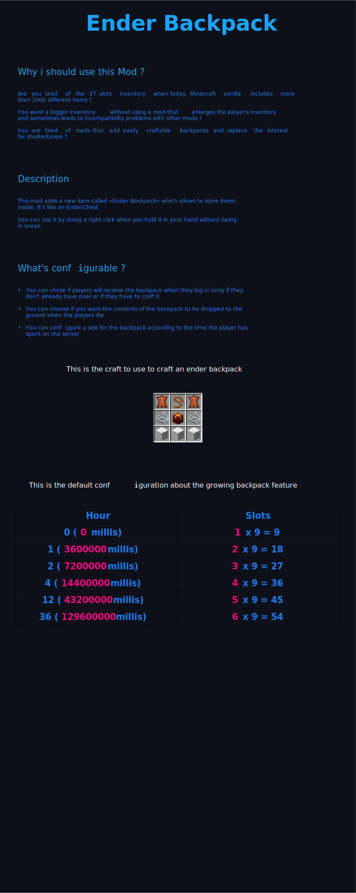
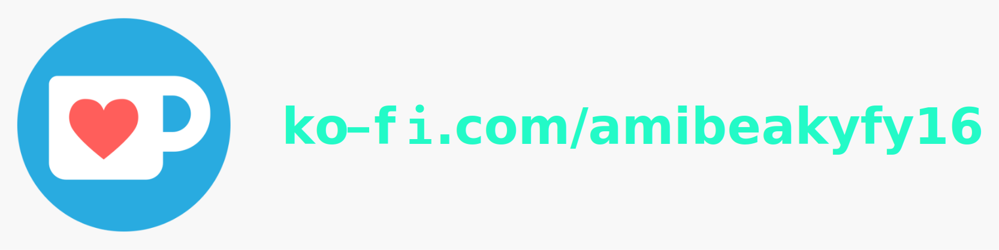

___

    Did you like the mod ?

    Sponsor me !

    
    

## License

This mod is licensed under the MIT license. You can freely include the mod on any modpack with no permission. Usage of this mod's code on other projects is allowed as long as attribution is given.

[//]: # (<embed src="docs/readme.pdf" type="application/pdf">)

[//]: # ()
[//]: # (<object data="docs/readme.pdf" type="application/pdf" width="100%">)

[//]: # (</object>)

[//]: # (# Description)

[//]: # (This mod adds a backpack, but with unique content per player. Even if you duplicate it, its contents will be identical to the first one. A bit like an enderchest)

[//]: # ()
[//]: # (As the player spends more time on the server, the backpack will grow and the player will be able to store more items. The default configuration is as follows:)

[//]: # (| hours  | slots available                       |)

[//]: # (| ------ |:----------------:| )

[//]: # (|    0   | 1*9 = 9          |)

[//]: # (|    1   | 2*9 = 18         |)

[//]: # (|    2   | 3*9 = 27         |)

[//]: # (|    4   | 4*9 = 36         |)

[//]: # (|   12   | 5*9 = 45         |)

[//]: # (|   36   | 6*9 = 54         |)

[//]: # ()
[//]: # (You can create your own ***sizes*** by settings a time in millisecond as key and a number of rows as value)

[//]: # ()
[//]: # (max rows is 6)

[//]: # ()
[//]: # ()
[//]: # (**Important !**)

[//]: # (**Values in the list must be sorted from smallest to largest. whether it is the size or the delay**)

[//]: # ()
[//]: # ()
[//]: # (## There are two way to use this mod)

[//]: # (1. Players will receive a backpack when they log in &#40;only if they don't already have one&#41; Here is the configuration of the **config.json** file to use the first way ![Alt text]&#40;https://github.com/AmibeSkyfy16/EnderBackpack/blob/1.18.2/images/config_first_way.png&#41;)

[//]: # ()
[//]: # (2. Players will have to craft the backpack Here is the configuration of the **config.json** file to use the second way ![Alt text]&#40;https://github.com/AmibeSkyfy16/EnderBackpack/blob/1.18.2/images/config_second_way.png?raw=true&#41; And this is the craft ![Alt text]&#40;https://github.com/AmibeSkyfy16/EnderBackpack/blob/1.18.2/images/craft.png?raw=true&#41;)

[//]: # ()
[//]: # ()
[//]: # (## Other configurations)

[//]: # (You can choose if you want the contents of the backpack to be dropped to the ground when the players die using the settings option called dropBackpackContentWhenDying &#40;by default, the contents are saved &#40;as an enderchest&#41;. )

[//]: # ()
[//]: # (## Why this mod)

[//]: # (Today, Minecraft contains many more items than before, especially with the 1.18 update and not to mention the mods that add a lot of items. Players need more space in their inventory. Most of the backpack mods can be made easily and have their own inventory &#40;not a unique content per player&#41;, so there is no more interest in shulkerboxes.)

[//]: # ()
[//]: # (## Special Thanks)

[//]: # (DanikingRD)
